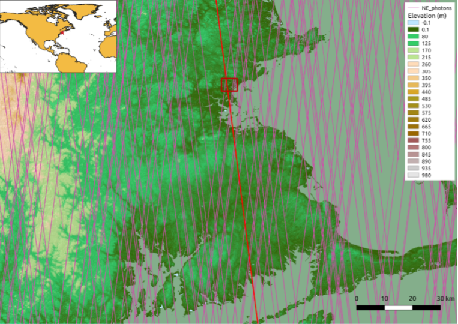
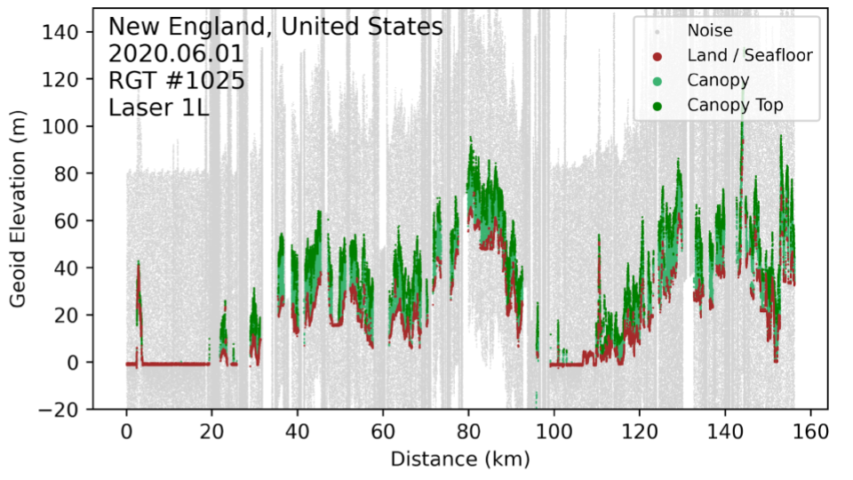
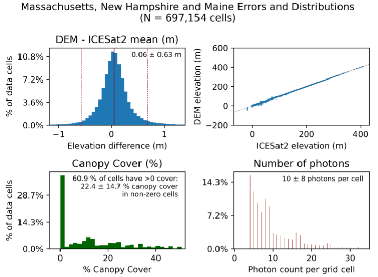

# IVERT
## The ICESat-2 Validation of Elevations Reporting Tool
(Note: The following README is being prepared in preparation for the IVERT v0.6 release, coming soon. Some functionality outlined below are not yet available in version 0.5.3. Update coming soon. This parenthetical will be removed when v0.6 is released.)

The ICESat-2 Validation of Elevations Reporting Tool (IVERT) is a command-line tool for directly comparing elevation values from raster Digital Elevation Models (DEM) and performing statistical validations against elevations from the NASA Ice, Cloud, and Land Elevation Satellite 2 (ICESat-2).

IVERT is meant to be run either as a standalone desktop tool or in a cloud-based environment. Currently only the standalone functionality is directly supported as a download from this GitHub Repository. The code is being used in a cloud environment behind NOAA's NESDIS Cloud Computing Framework (NCCF) but is that interface is not yet publicly available and relies on some code that is not yet fully integrated into this repository. A future release will fully support users setting up their own cloud environments that can readily scale-up to perform large validation jobs in the cloud.

IVERT's inputs include:
- A DEM raster file, or a set of DEM raster files in a common format and reference frame (both vertical and horizontal). IVERT was originally designed to validate GeoTiff files but we are currently expanding support for NetCDF and other formats.
- A known vertical reference frame (preferably with a publicly-available EPSG code) for the DEM or set of DEMs.

IVERT will perform the following actions:
- Download ICESat-2 data ([both ATL03 and ATL08](https://icesat-2.gsfc.nasa.gov/science/data-products)) over the region(s) covered by the DEM.
- Link the ATL03 (photon) and ATL08 (land-cover segment) data to classify each photon as land surface, canopy, canopy top, or noise/atmosphere.
- Run the [CShelph algorithm](https://github.com/nmt28/C-SHELPh) to classify bathymetry surface and bathymetry bed photons, as well as modify the position of sub-aquatic photons to accurately relay their position when refractively travelling through water. (Soon to be replaced by NSIDC ATL-24 data.)
- Classify the ICESat-2 photons that hit building tops according to the [Bing Global Building Footprints](https://blogs.bing.com/maps/2023-06/Bing-Maps-Global-Building-Footprints-released) dataset. These photons will be filtered out if comparing with a bare-earth DEM.
- Horizontally translate the ICESat-2 data into the horizontal reference frame of the DEM.
- Vertically translate the ICESat-2 data to match the vertical reference frame of the DEM using [CUDEM's "vdatums" tool](https://github.com/ciresdem/cudem/blob/main/cudem/vdatums.py), which itself incorporates [NOAA's "VDatum"](https://vdatum.noaa.gov/) program as well as other functionality).
- Bin elevations into DEM grid cell, remove outliers, and compute statistics of DEM elevations compared to ICESat-2.

IVERT outputs:
- A sparse raster grid of DEM Errors, in the same geo-referenced grids as the incoming datasets.
- An autogenerated plot of summary statistics for each DEM and the entire dataset ensemble (combined, see above).
- An HDF5 database of grid-cell summary results.
- A textfile summary of validation results for each DEM and the entire dataset ensemble.
- (Optional) A HDF5 of transformed ICESat-2 photons used in the validation process.

Updates (along with further installation instructions) will be made as the IVERT v0.6 release is released.